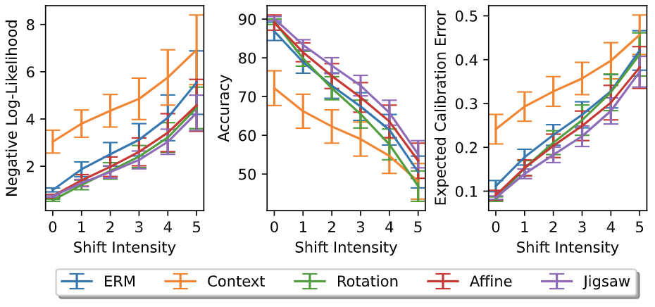

# reliable_ssl_baselines

## Table of Content

1. [Introduction](#intro)
2. [Guideline](#guideline)
    - [To prepare](#prepare)
    - [To run experiments](#experiments)
    - [To plot figures](#plot)
    - [To download checkpoints](#checkpoints)

## <a name="intro"></a> Introduction


This repository contains the implementation of "Benchmark for Uncertainty & Robustness in Self-Supervised Learning", including a comparison of ERM, Context Prediction, Rotation Prediction, Geometric Transformation Prediction, and Jigsaw Puzzle.

## <a name="guideline"></a> Guideline
### <a name="prepare"></a> To prepare:
Install prerequisite packages:
```sh
python -m pip install -r requirements.txt
```

Download and unzip the datasets:
```sh
bash setup.sh
```

### <a name="experiments"></a> To run experiments:
Run with 10 different seeds:
```sh
for i in {1..10}; do
     taskset -c <cpu_index> python main.py --config <config_path> --exp_idx $i --gpu_idx <gpu_index>
done
```
where the parameters are the following:
- `<cpu_index>`: CPU index. E.g., `<cpu_index> = "1"`
- `<config_path>`: path stored configuration hyper-parameters. E.g., `<config_path> = "algorithms/Jigsaw/configs/CIFAR10.json"`
- `<gpu_index>`: GPU index. E.g., `<gpu_index> = "0"`

BERT-GPT2 experiments are provided in notebooks in `"algorithms/BERT-GPT2/"`

**Note:** Select different settings by editing in `/configs/..json`, logging results are stored in `/results/logs/`


### <a name="plot"></a> To plot figures:

```sh
python utils/ebar_plot.py
python utils/box_plot.py
python utils/plot_density.py
python utils/plot_density_methods.py
python utils/reliability_diagram.py
```




### <a name="plot"></a> To download checkpoints:

**Note:** All checkpoints are stored at [this google drive folder](https://drive.google.com/drive/folders/1Goy76FCp8NmlQiwAuQdj7HETOy85jLMa?usp=share_link).

**Note:** All results are recorded at [this google excel](https://docs.google.com/spreadsheets/d/1QdYtDm_GA76hfpso8RoAeysn3Yg3WPeJ91VXahhoPgM/edit?usp=share_link).

## License

This source code is released under the Apache-2.0 license, included [here](LICENSE).
